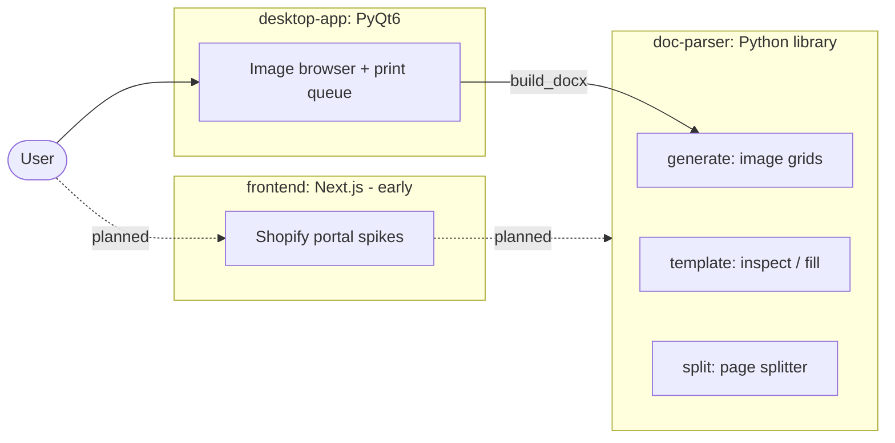

# Product Tooling Portfolio

A small collection of related tools built for a physical-product e-commerce workflow
(custom-printed merchandise: lighters, stash jars, grinders, rolling trays). The work is
split into three independent pillars, each in its own folder.

## The three pillars

| Folder | What it is | Stack |
| --- | --- | --- |
| [`doc-parser/`](doc-parser/) | Reusable Python library for Word (`.docx`) documents: generate print-ready image grids, and inspect / split / fill existing templates at the OOXML level. | Python, `python-docx`, `Pillow`, `lxml` |
| [`desktop-app/`](desktop-app/) | Cross-platform desktop app to browse an image folder, build a print queue, and export a sized `.docx` grid. Uses `doc-parser` for the export. | Python, PyQt6 |
| [`frontend/`](frontend/) | Early-stage web work toward a Shopify merchant portal: framework spikes, a Shopify API spike, and the design plan. | Next.js, React, TypeScript |

## How they relate



The desktop app is the most complete piece and depends on the `doc-parser` library.
The frontend is exploratory: see [`frontend/plan.md`](frontend/plan.md) for the intended
direction.

## Quickstart

```bash
# 1. Doc-parser library (install editable so the desktop app can import it)
python -m venv .venv && source .venv/bin/activate
pip install -e doc-parser

# 2. Desktop app
pip install -r desktop-app/requirements.txt
python desktop-app/main.py

# 3. Frontend spikes (each is a standalone Next.js project)
cd frontend/next-dashboard && pnpm install && pnpm dev
```

See each folder's `README.md` for details.
